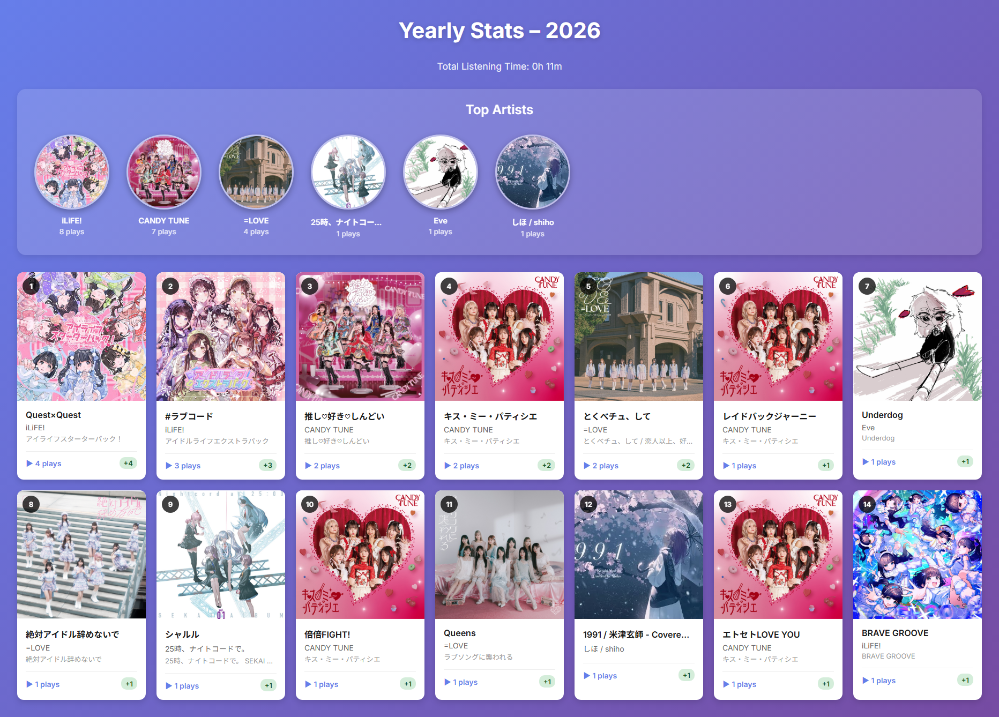
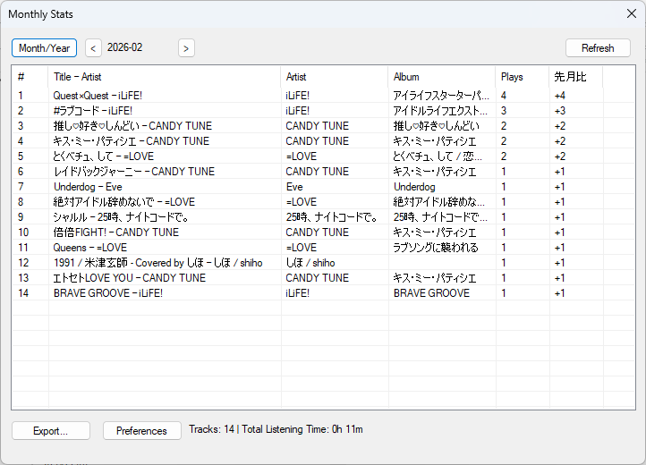

# foo_monthly_stats

A foobar2000 component that tracks and visualizes your music listening statistics on a monthly and yearly basis.

<!-- TODO: Add actual screenshot here. Replace the placeholder URL below with a real image -->
<!--
Example: 
For now, using placeholder:
-->

## Features

- 📊 **Monthly & Yearly Statistics**: View your listening history organized by month or year
- 🎵 **Track Play Counts**: Records the number of times each track is played with accurate playback time tracking
- 📈 **Month-over-Month Comparison**: See how your listening habits change with delta indicators
- 🎨 **Beautiful HTML Reports**: Export visually appealing reports with album artwork
- 🏆 **Top Artists Ranking**: Highlights your most-played artists with circular album art
- ⏱️ **Total Listening Time**: Calculates and displays your total listening time
- 🗄️ **SQLite Database**: Efficient local storage of listening history
- 🖼️ **Album Art Integration**: Displays album artwork in reports using embedded thumbnails

## Installation

### Option 1: Install Pre-built Component

1. Download the latest `.fb2k-component` file from the [Releases](../../releases) page
2. Open foobar2000
3. Go to **File → Preferences → Components → Install...**
4. Select the downloaded `.fb2k-component` file
5. Restart foobar2000

### Option 2: Build from Source

See [BUILD.md](BUILD.md) for detailed build instructions.

Requirements:

- Visual Studio 2022 or later
- Windows 10/11
- foobar2000 SDK (included in repository)

## Usage

### Opening the Dashboard

1. In foobar2000, go to **View → Monthly Stats Dashboard**
2. The dashboard window displays your current month's statistics by default

### Navigating Statistics

- **◀ / ▶ buttons**: Navigate to previous/next month or year
- **Month/Year toggle**: Switch between monthly and yearly aggregation views
- **Refresh button**: Reload statistics from the database
- **Export button**: Generate HTML report with your statistics

### Viewing Reports

Exported HTML reports include:

- Title with period (e.g., "Monthly Stats – 2026-02" or "Yearly Stats – 2026")
- Total listening time summary
- Top Artists ranking with album artwork
- Complete track listing with play counts and comparison to previous period
- Beautiful gradient design optimized for sharing

## How It Works

- **Playback Tracking**: The component uses foobar2000's `play_callback` API to monitor playback events
- **Accurate Time Recording**: Records actual playback time (stops counting if you skip or pause)
- **Background Processing**: Database operations run on a separate worker thread to avoid UI blocking
- **Album Art Collection**: Extracts and converts album art to base64 JPEG for embedding in HTML reports

## Technical Details

- **Language**: C++17
- **UI Framework**: WTL (Windows Template Library) + ATL
- **Database**: SQLite 3 (amalgamation)
- **XML Processing**: pugixml
- **SDK**: foobar2000 SDK 2023
- **Build System**: MSBuild with custom Directory.Build.props/targets

## Database Schema

The component stores data in `monthly_stats.db` located in your foobar2000 profile directory.

**Main Table: `monthly_count`**

- `ym`: Year-Month (e.g., "2026-02")
- `track_crc`: CRC32 hash of normalized track path
- `path`: Original file path
- `title`, `artist`, `album`: Metadata fields
- `playcount`: Number of times played
- `length_seconds`: Total playback time in seconds

## License

This project includes code and libraries under various licenses:

- **foobar2000 SDK**: See [sdk-license.txt](../sdk-license.txt)
- **SQLite**: Public Domain
- **pugixml**: MIT License
- **WTL**: Microsoft Public License
- **Catch2** (tests): Boost Software License 1.0

The plugin code itself is released under the MIT License.

## Contributing

Contributions are welcome! Please ensure:

- Code follows the existing style conventions
- Changes are tested on x64 Release builds
- Database schema changes include migration logic

## Acknowledgments

- foobar2000 and its SDK by Peter Pawlowski
- SQLite by D. Richard Hipp
- pugixml by Arseny Kapoulkine
- WTL by Microsoft

---

# 日本語説明

foobar2000用の月次・年次再生統計コンポーネントです。

## 主な機能

- 📊 **月次・年次統計**: 月別または年別に再生履歴を表示
- 🎵 **トラック再生回数記録**: 正確な再生時間トラッキングで各曲の再生回数を記録
- 📈 **前月比較**: 前月/前年との比較をデルタ表示で確認
- 🎨 **美しいHTMLレポート**: アルバムアートワーク付きの見やすいレポートをエクスポート
- 🏆 **トップアーティストランキング**: 最も再生したアーティストを丸いアルバムアートで表示
- ⏱️ **総再生時間**: 累計リスニング時間を計算・表示
- 🗄️ **SQLiteデータベース**: 効率的なローカルストレージ
- 🖼️ **アルバムアート統合**: レポートにアルバムアートワークをサムネイル埋め込み

## インストール方法

### 方法1: ビルド済みコンポーネントをインストール

1. [Releases](../../releases)ページから最新の`.fb2k-component`ファイルをダウンロード
2. foobar2000を起動
3. **ファイル → 設定 → Components → インストール...** を選択
4. ダウンロードした`.fb2k-component`ファイルを選択
5. foobar2000を再起動

### 方法2: ソースからビルド

詳細なビルド手順は[BUILD.md](BUILD.md)を参照してください。

必要な環境:

- Visual Studio 2022以降
- Windows 10/11
- foobar2000 SDK（リポジトリに含まれています）

## 使い方

### ダッシュボードを開く

1. foobar2000のメニューから **表示 → Monthly Stats Dashboard** を選択
2. ダッシュボードウィンドウに現在の月の統計が表示されます

### 統計を操作する

- **◀ / ▶ ボタン**: 前月/次月（または前年/次年）に移動
- **Month/Yearボタン**: 月次表示と年次表示を切り替え
- **Refreshボタン**: データベースから統計を再読み込み
- **Exportボタン**: HTMLレポートを生成

### レポートを表示する

エクスポートされたHTMLレポートには以下が含まれます:

- 期間のタイトル（例: "Monthly Stats – 2026-02" または "Yearly Stats – 2026"）
- 総再生時間のサマリー
- トップアーティストランキング（アルバムアートワーク付き）
- 全トラックリスト（再生回数と前期比較付き）
- シェアに最適化された美しいグラデーションデザイン

## 動作原理

- **再生トラッキング**: foobar2000の`play_callback` APIを使用して再生イベントを監視
- **正確な時間記録**: 実際の再生時間を記録（スキップや一時停止時はカウント停止）
- **バックグラウンド処理**: データベース操作は別スレッドで実行しUIをブロックしない
- **アルバムアート収集**: アルバムアートを抽出してbase64 JPEGに変換し、HTMLレポートに埋め込み

## 技術仕様

- **言語**: C++17
- **UIフレームワーク**: WTL (Windows Template Library) + ATL
- **データベース**: SQLite 3（amalgamation版）
- **XML処理**: pugixml
- **SDK**: foobar2000 SDK 2023
- **ビルドシステム**: MSBuild（カスタムDirectory.Build.props/targets使用）

## データベーススキーマ

コンポーネントはfoobar2000プロファイルディレクトリ内の`monthly_stats.db`にデータを保存します。

**メインテーブル: `monthly_count`**

- `ym`: 年月（例: "2026-02"）
- `track_crc`: 正規化されたトラックパスのCRC32ハッシュ
- `path`: 元のファイルパス
- `title`, `artist`, `album`: メタデータフィールド
- `playcount`: 再生回数
- `length_seconds`: 総再生時間（秒）

## ライセンス

このプロジェクトには様々なライセンスのコードとライブラリが含まれています:

- **foobar2000 SDK**: [sdk-license.txt](../sdk-license.txt)を参照
- **SQLite**: パブリックドメイン
- **pugixml**: MITライセンス
- **WTL**: Microsoft Public License
- **Catch2**（テスト用）: Boost Software License 1.0

プラグインコード自体はMITライセンスでリリースされています。

## 貢献

コントリビューションを歓迎します！以下の点にご注意ください:

- 既存のコードスタイル規則に従ってください
- x64 Releaseビルドでテストを実施してください
- データベーススキーマ変更時はマイグレーションロジックを含めてください

## 謝辞

- Peter Pawlowski氏によるfoobar2000とそのSDK
- D. Richard Hipp氏によるSQLite
- Arseny Kapoulkine氏によるpugixml
- MicrosoftによるWTL
